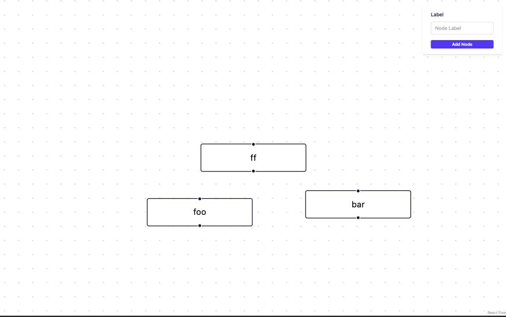

# Front-end interview task
 
## Installation
`npm install`
note: you can use another package manager, npm here is just an example

## Running the project
`npm run dev`

## **Candidate ID**

* You must use a **static, unique candidate ID** for the entire interview.
* You can use:
    * your GitHub username, **or**
    * a generated UUID ([https://www.uuidgenerator.net/](https://www.uuidgenerator.net/)).
* This ID is required for accessing your dedicated API space.
* **All API requests must include**:
  `x-candidate-id: <your_id>`

## **Goal of the Task**

The user should be able to build **arbitrary flowcharts** with custom nodes. Nodes can have a label, and can be connected to other nodes.

This project is using the following technologies:
* **React** (Vite + Typescipt)
* **React Flow** ([https://reactflow.dev](https://reactflow.dev))
* Optional but recommended: **TailwindCSS** (styling) [tailwindcss](https://tailwindcss.com/)
* Optional but recommended: **TanStack Query** (data fetching) [tanstack query](https://tanstack.com/query/latest/docs/framework/react/overview)

__!!!IMPORTANT!!!__: The project is already scaffolded and the primary libraries are already installed, so you can start working right away. If you do not know TailwindCSS or TanStack Query, please tell in advance!


## **Time Limit**
- 35 min


## **Required Reading (React Flow Docs)**

Read these before starting (approx. 5 min):

1. [https://reactflow.dev/learn](https://reactflow.dev/learn) // note: do not install reactflow, it is already installed in the project
2. [https://reactflow.dev/learn/concepts/terms-and-definitions](https://reactflow.dev/learn/concepts/terms-and-definitions)

## **Requirements**

__YOU ARE ALLOWED TO CHANGE THE PROJECT STRUCTURE AND THE CODE AS YOU SEE FIT.__
__INSTALLATION OF NEW LIBRARIES IS ALLOWED, BUT YOU MAY NEED TO EXPLAIN THE REASONING BEHIND IT.__

### **Glossary**
- Field - the canvas, where the nodes are rendered. 
- Panel - React Flow Panel, which user can use to create custom nodes on the field

You already have a scaffolded project with React Flow and TailwindCSS.
The Panel component is already available. However, you need to style it and add the submit handler.


Here is an example of the Panel (top-right corner):


### **Persistence**

__!!!IMPORTANT!!!__: the implementation of this functionality is the most valuable

You must **persist graph data across sessions** using the API.
This means, if the user opens the webpage in a different tab or even in a different browser,
the content should be the same. We __DO NOT__ need the synchronization over websockets. 
Reloading the page is enough.

### **On Page Load**

* Fetch the latest saved file from:

  ```
  GET /file
  ```
Note: you may receive 404 NOT_FOUND if there is no file

### **On Graph Change**

* Upload the latest snapshot to:

  ```
  POST /file
  ```

### **Important Constraint**

* Do **NOT** upload on every small change.
* The server allows **300 requests per minute per candidate**.
  (This is a safeguard — you don’t need to implement rate-limiting logic, but think about debouncing updates.)

We will evaluate how you handle the debouncing logic and concurrent updates.

### Recommended

Use **TanStack Query** for fetch/upload:
[https://tanstack.com/query/latest](https://tanstack.com/query/latest)


## **API Details**

**Base URL**:
`https://graph-canvas-server-255258756697.europe-west1.run.app`

### **Authorization**

Every request must include:

```
x-candidate-id: <your_static_id>
```

If you forget this header, you’ll get:

```
{"status":"error","error":{"code":"INVALID_ARGUMENT","message":"'x-candidate-id' header is required"}}
```

---

## **Endpoints**

### **Upload file**

```
POST /file
```

* Uploads your graph file (any format: JSON, YAML, CSV, etc.).
* The server will store:

    * `content-type`
    * `content-encoding`
    * `content-disposition`

Note: this server doesn't accept the FormData, use the raw bytes
```typescript
let snapshot = {
    /* ... */
};
let serialized = JSON.stringify(snapshot);
let response = await fetch(`https://graph-canvas-server-255258756697.europe-west1.run.app/file`, {
    method: "POST",
    headers: {
        "Content-Type": "application/json",
        "x-candidate-id": "f0d4f28b-998c-4adc-9371-c7335d8dc899"
    },
    body: serialized,
});

```

### **Download file**

```
GET /file
```

* Returns the file you previously uploaded.
* Restores the headers you originally sent.
* If you used `content-encoding`, your browser may auto-decode.

---

## **Error Format**

Errors always use this structure:

```json
{
  "status": "error",
  "error": {
    "code": "INVALID_ARGUMENT",
    "message": "Readable error message",
    "details": []
  }
}
```

### **Possible Error Codes**

```ts
INVALID_ARGUMENT   // 400
NOT_FOUND          // 404
TOO_MANY_REQUESTS  // 429
INTERNAL           // 500
```

# bryan-FE-task
